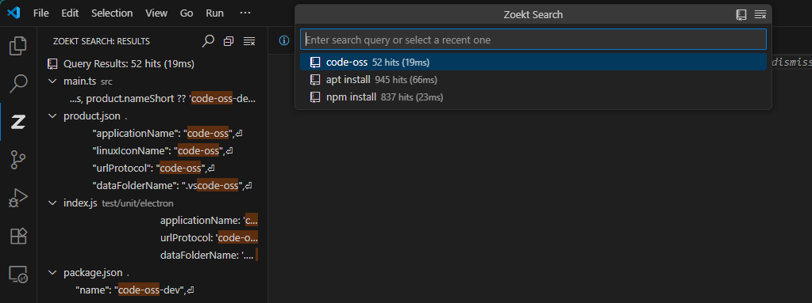
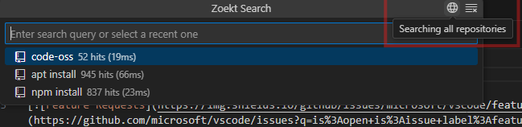
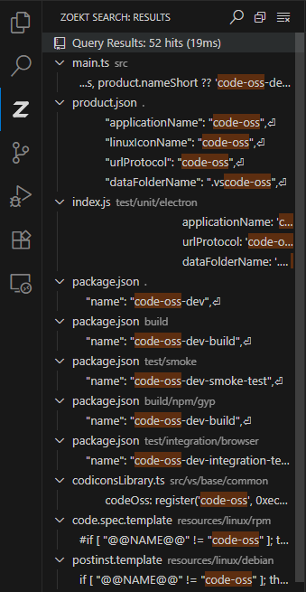
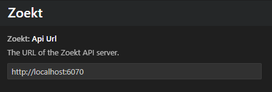

# Zoekt Code Search for Visual Studio Code

Search code repositories of any size in milliseconds locally, even when the built-in VSCode search grinds to a halt!

This extension integrates with an existing [Zoekt webserver](https://github.com/sourcegraph/zoekt/tree/main?tab=readme-ov-file#indexing-a-local-git-repo) via JSON API to facilitate code searching within your projects. It allows users to perform searches, view results, and open files directly in the editor.

- Lightning fast local code search across multiple repositories using the rich [Zoekt query language](https://github.com/sourcegraph/zoekt/blob/main/doc/query_syntax.md), which supports filtering repository names, language, and more:

        content:test (lang:python or lang:javascript)
        (repo:repo1 or repo:repo2)
        lang:go or lang:java

- Open result files directly in the editor
- Great alternative to default VSCode search for large repositories
- Versatile code search solution: run the zoekt server locally or offload it to another machine and serve the index with any amount users

## Planned Features

- [ ] Open remote files from other repositories directly in editor (currently just opens repository link)
- [ ] Support viewing results from past commits

## Usage

- Use the `Zoekt: Search` function in the Command Pallette
- Press `Ctrl+Shift+K` (by default) on selected text to populate the query

- Switch from local workspace to global repository search mode:

    

- Navigate the Zoekt search results view sidebar

    

## Setup

1. [Install Zoekt](https://github.com/sourcegraph/zoekt/tree/main?tab=readme-ov-file#installation)
2. Index all desired code repositories into one index (`~/.zoekt` in this case):

        zoekt-git-index -index ~/.zoekt /path/to/repo

3. Start the Zoekt webserver to serve the index:

        zoekt-webserver --index ~/.zoekt -rpc

   Note, this extension requires `-rpc` to communicate with Zoekt.

    _The index location for `--index` by default is `~/.zoekt`_

4. Point zoekt-vscode at the webserver in the VSCode settings:

    

## Installation

### Marketplace

Get the extension on the [Marketplace](https://marketplace.visualstudio.com/items?itemName=H3mul.zoekt-vscode)!

### Github Releases

1.  Download the latest release from the [GitHub Releases](https://github.com/h3mul/zoekt-vscode/releases) page.
2.  In VS Code, open the Extensions view (`Ctrl+Shift+X`).
3.  Click the "..." menu in the Extensions view and select "Install from VSIX...".
4.  Choose the downloaded `.vsix` file.

## Contribution
Contributions are welcome! Please open an issue or submit a pull request for any enhancements or bug fixes.

## License
This project is licensed under the MIT License. See the LICENSE file for details.